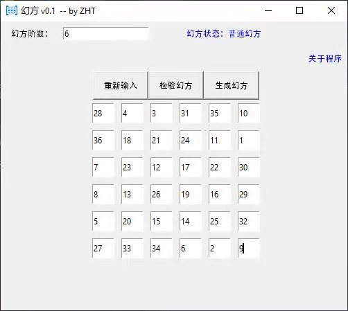

# magic-square 幻方
v0.1 实现**普通幻方**与**完美幻方**的检查，幻方的定义参考：


主要参考[百度百科](https://baike.baidu.com/item/%E5%B9%BB%E6%96%B9)、[西塘沿河博客](http://blog.sina.com.cn/s/blog_4cfcf1650102xabk.html)
```
A magic square is a n × n grid of numbers such that the sum of each row is equal, and equal to the sum of each column.
  4 9 2
  3 5 7
  8 1 6
Some definitions also require the sum along the main diagonals to add to the same total.
```
普通幻方定义为行、列、主、副对角线各数之和均相等。

完美幻方（完全幻方）定义为行、列、主、副对角线及泛对角线各数之和均相等。

## Demo





## 其他参考
[Wiki](https://en.wikipedia.org/wiki/Magic_square)

[Jenny Kenkel 课件](https://www.math.utah.edu/~kenkel/magicsquarestalk.pdf)

[知乎](https://zhuanlan.zhihu.com/p/64018906)
